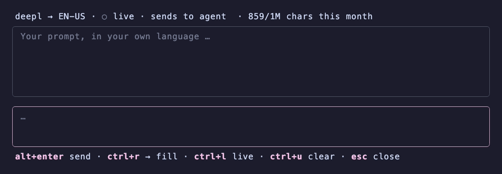

# polyglot

[](https://github.com/wazum/herdr-polyglot/actions/workflows/ci.yml)
[](go.mod)
[](https://herdr.dev)
[](LICENSE)

Write prompts in the language you think in and keep the conversation in English.
A [*herdr*](https://herdr.dev) plugin: press a key on any agent pane, an overlay
opens above it, you write, and the English translation lands in the agent's
input. It works with *Claude Code*, *Codex*, *opencode* and the rest, because
the prompt goes through *herdr* rather than into a particular tool.



## Why this exists

An agent answers in the language it was asked in. Write to it in German and the
replies come back in German — and so do the comments it puts in the code, the
commit messages, the documentation, and sometimes the identifiers themselves. A
codebase should be in one language, and that language is English.

The prompt is the one place another language belongs. You write it in yours, the
agent reads it in English, and nothing it produces switches language.

With live translation on, every prompt you write appears in English right beside
it. Read a few hundred of those and it rubs off — practice that was never the
point.

## Quick start

```bash
herdr plugin install wazum/herdr-polyglot
```

Put your key in the plugin's own config directory, readable only by you — a
plain redirect would leave it readable by everyone on the machine:

```bash
ENV_FILE="$(herdr plugin config-dir wazum.polyglot)/.env"
touch "$ENV_FILE" && chmod 600 "$ENV_FILE"
echo "HERDR_POLYGLOT_API_KEY=your-deepl-key" >> "$ENV_FILE"
```

A [*DeepL* API key](https://www.deepl.com/pro-api) has a free tier. Free keys
end in `:fx`, and the plugin sends those to *DeepL*'s free host by itself.

Then bind a key in `~/.config/herdr/config.toml`:

```toml
[[keys.command]]
key = "prefix+t"
type = "plugin_action"
command = "wazum.polyglot.prompt"
description = "write a prompt in your own language"
```

`t` as in translate — *herdr* already uses `prefix+p` for the previous tab.
There is a second action, `wazum.polyglot.compose`, which types the prompt into
the agent's input instead of sending it, and `ctrl+r` switches between the two
while you write, so one keybinding is enough.

## In the popup

| | |
| --- | --- |
| `alt+enter` | translate and hand the prompt over (`ctrl+d` does the same) |
| `enter` | a new line, because a prompt is often more than one |
| `ctrl+r` | switch between sending it and only filling the input |
| `ctrl+l` | turn live translation on or off for this prompt |
| `ctrl+u` | throw the draft away, as it clears a line in a shell |
| `esc` | close — with vim bindings on, first to normal mode, then close |
| `ctrl+c` | close, always |

The header says which of the two will happen: `sends to agent` hands the prompt
over and the agent starts working, `fills the input` types it there and leaves
the last keystroke to you. When something does not work the footer says so,
`esc` takes the message away, and it goes by itself after a few seconds.

## Settings

Every setting can be a line in the `.env` file or an environment variable, which
wins over the file. A value that is neither on (`1`, `true`, `yes`, `on`) nor
off (`0`, `false`, `no`, `off`) is refused rather than guessed at.

| Setting | Default | Meaning |
| --- | --- | --- |
| `HERDR_POLYGLOT_API_KEY` | none | Credentials for the translation service |
| `HERDR_POLYGLOT_PROVIDER` | `deepl` | Which service: `deepl` or `dry-run` |
| `HERDR_POLYGLOT_LANGUAGE` | `EN-US` | Target language |
| `HERDR_POLYGLOT_ENDPOINT` | the service's own | Override the service endpoint |
| `HERDR_POLYGLOT_SUBMIT` | `1` | `0` types the prompt without sending it |
| `HERDR_POLYGLOT_VIM` | `0` | `1` turns on the [vim bindings](docs/vim.md) |
| `HERDR_POLYGLOT_LIVE` | `0` | `1` translates while you write |
| `HERDR_POLYGLOT_CONFIRM` | `0` | `1` shows the English and waits for a second `alt+enter` |
| `HERDR_POLYGLOT_KEEP_DRAFT` | `1` | `0` starts from an empty box instead of resuming |
| `HERDR_POLYGLOT_MAX_DRAFT` | `2000` | Characters before the box says the draft is too long |
| `HERDR_POLYGLOT_PULSE` | `1` | `0` stops the live circle from breathing |

With `HERDR_POLYGLOT_PROVIDER=dry-run` the overlay marks the draft instead of
translating it, so you can check the wiring without a key. To keep keys for
several services side by side, scope them by name:
`HERDR_POLYGLOT_DEEPL_API_KEY`.

## What else it does

**An unfinished prompt is kept.** Drafts are stored privately, one per pane, and
come back the next time you open the popup there, however it closed. A sent or
discarded draft is forgotten.

**Read the English first.** With `HERDR_POLYGLOT_CONFIRM=1`, `alt+enter`
translates and shows the result, a second `alt+enter` delivers it, and `esc`
goes back to writing. It costs one translation, not two.

**Live translation.** The English follows your draft after a short pause. Each
sentence is paid for once, and a translation you have already read is delivered
as it stands, so writing costs little more than sending —
[how that works](docs/live-translation.md). Live translation starts off for a
draft that came back from an earlier session and for text you paste in, since
neither is something you asked to have translated; `ctrl+l` turns it on.

**Vim bindings.** `HERDR_POLYGLOT_VIM=1` makes the draft box modal, with the
motions, edits and counts that make sense inside a text box —
[the full list](docs/vim.md).

## What leaves your machine

The draft goes to the translation service, so treat it the way you treat
anything you paste into a web translator: prompts for a coding agent carry file
paths, code and occasionally a secret, and in live mode the draft goes out again
after every pause in typing.

Nothing else leaves. The API key goes to the translation service only — never to
the agent, the *herdr* socket, a command line or a child process. Translated
text is stripped of control characters before it is typed into a pane, so
neither a line break nor an escape sequence can reach the agent's terminal.
`HERDR_POLYGLOT_PROVIDER=dry-run` keeps a draft off the network entirely.

## Development

```bash
make qa     # formatting, linting, race tests, vulnerability scan
make build
herdr plugin link .
```

The overlay names palette slots rather than fixed colours, so it takes on
whatever *herdr* theme is active, including a light one.
[How the pieces fit together](docs/architecture.md), including how to add
another translation service.

## Credits

Created with ♥ by [Wolfgang Klinger](https://wolfgang-klinger.dev/).

Built on [*herdr*](https://herdr.dev),
[*Bubble Tea*](https://github.com/charmbracelet/bubbletea) and
[*Lip Gloss*](https://github.com/charmbracelet/lipgloss).

## License

[MIT](LICENSE).
